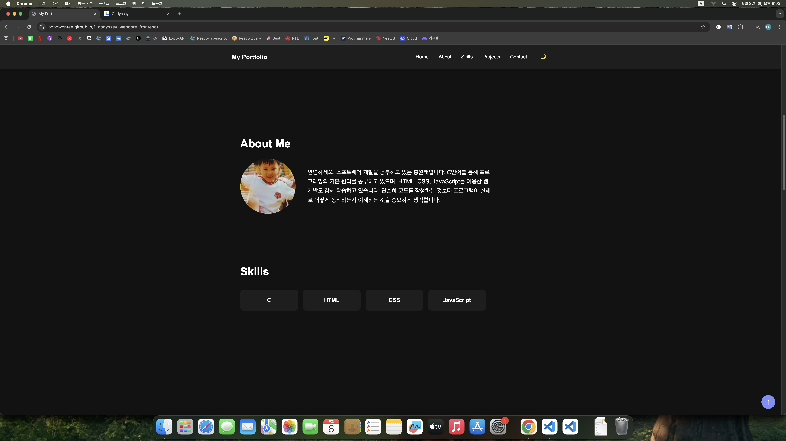
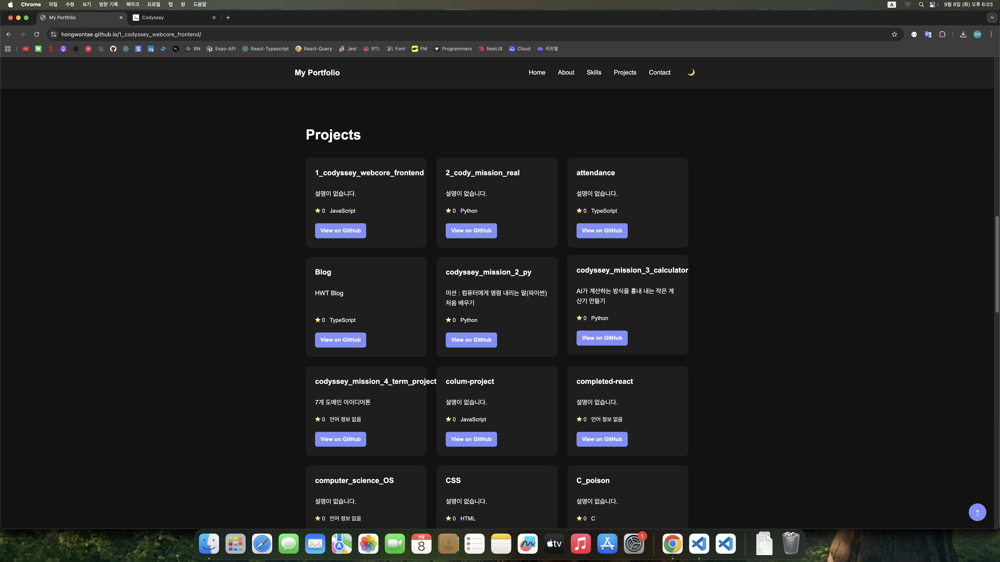
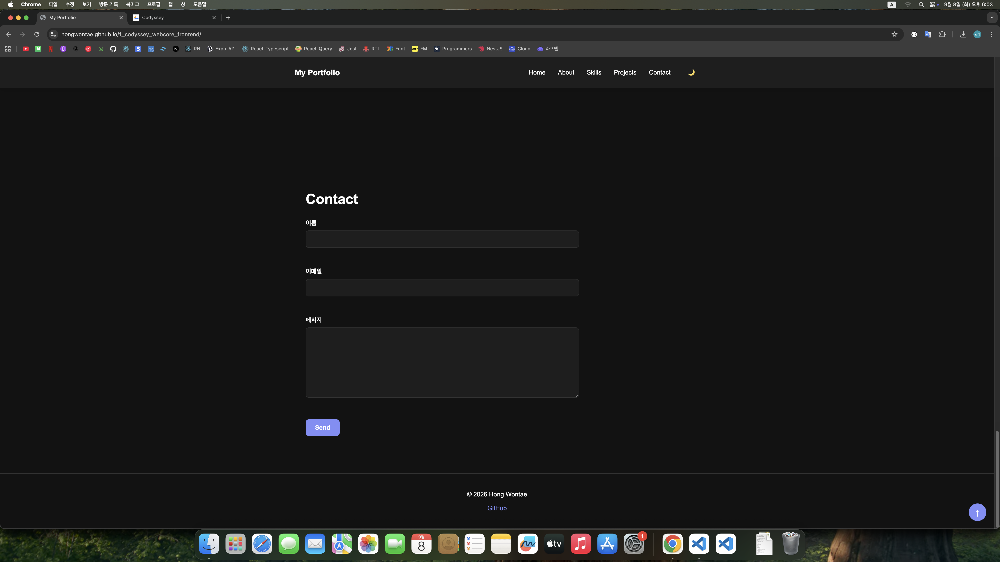
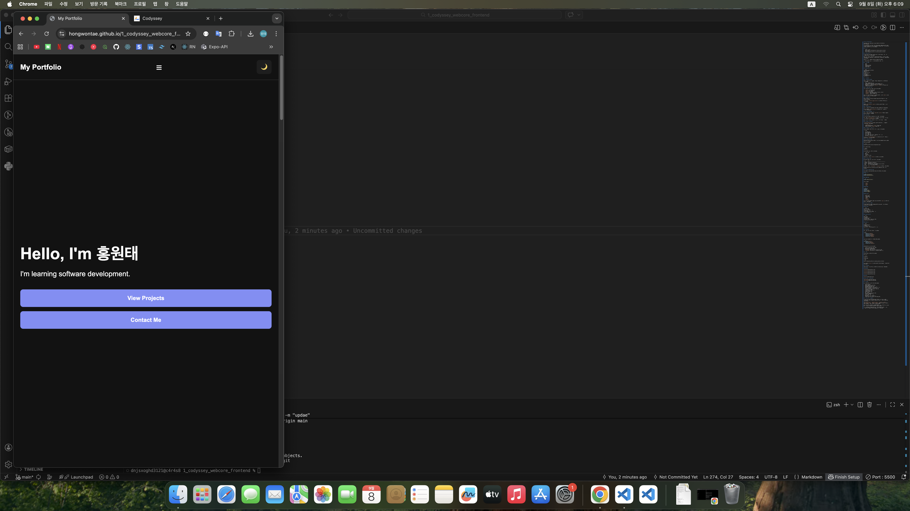
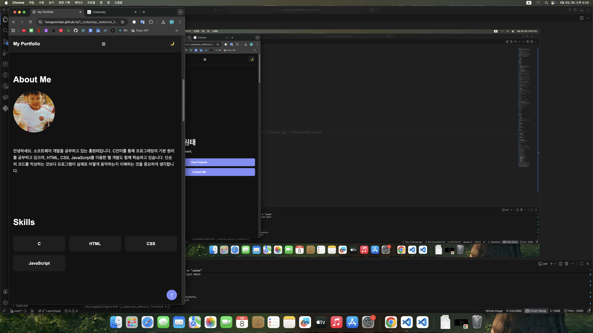
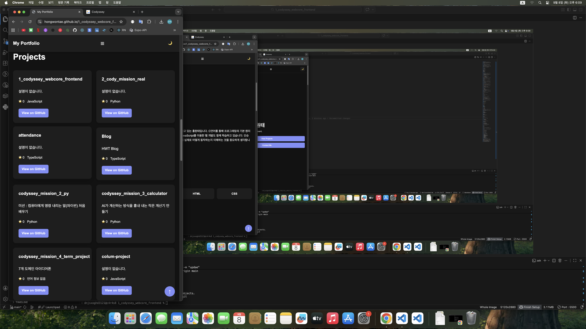
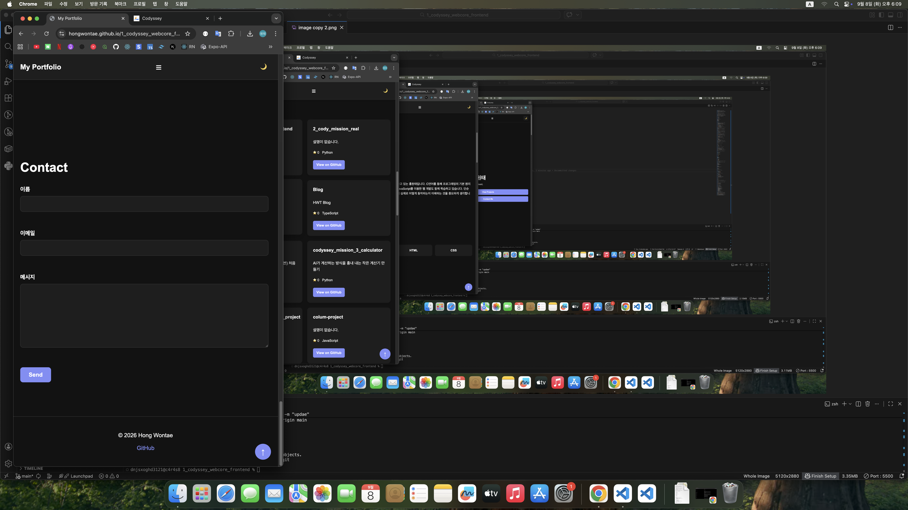
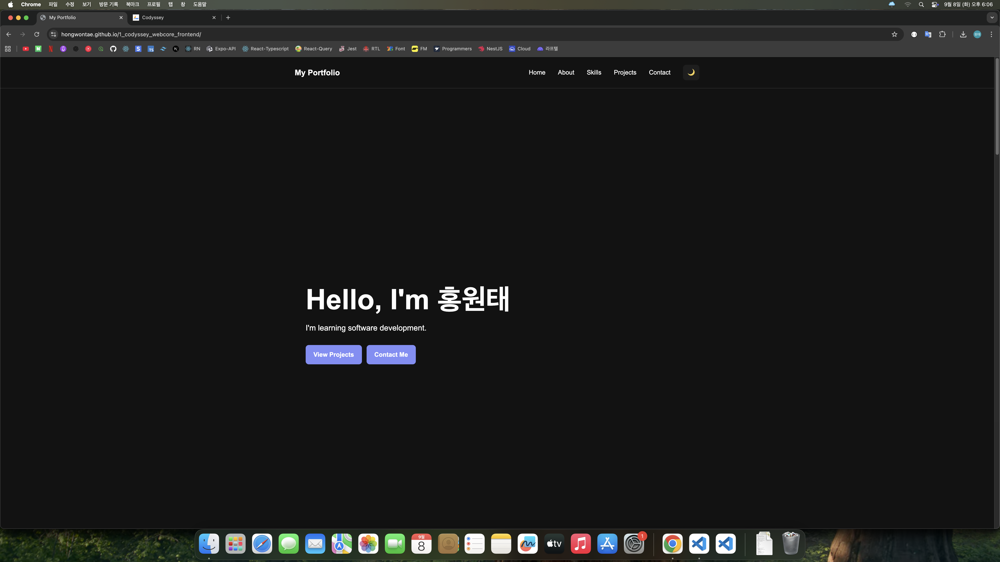
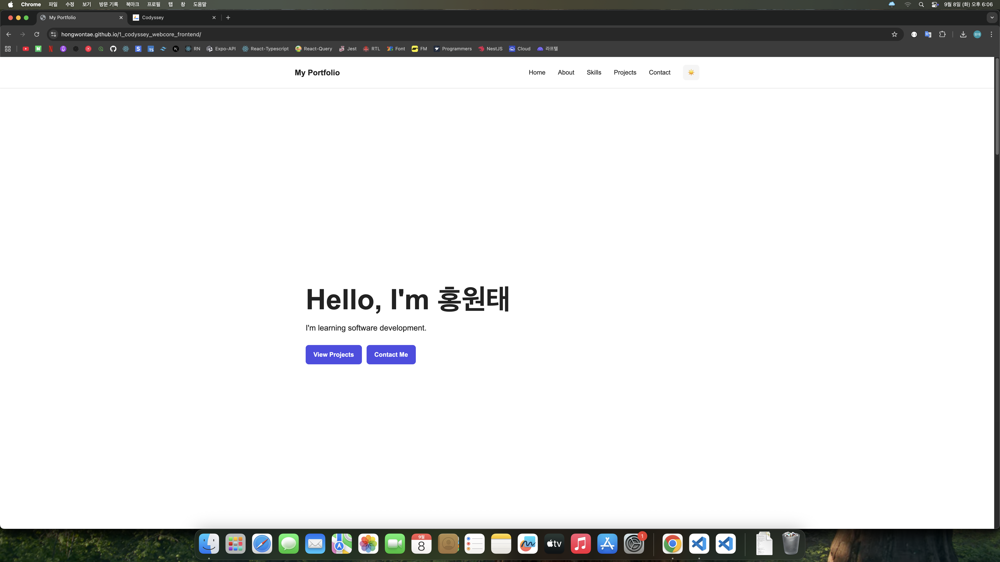

# 나를 소개하는 웹페이지

순수 HTML, CSS, JavaScript로 제작한 반응형 개인 포트폴리오
웹사이트입니다.

웹 개발의 기본이 되는 HTML, CSS, JavaScript의 구조와 동작 원리를 직접
구현하는 것을 목표로 했으며, GitHub API를 연동하여 실제 저장소 데이터를
Projects 섹션에 동적으로 표시했습니다.

## 🔗 링크

-   GitHub 저장소:
    https://github.com/hongwontae/1_codyssey_webcore_frontend
-   배포 사이트:
    https://hongwontae.github.io/1_codyssey_webcore_frontend/

## 📌 프로젝트 소개

이 프로젝트는 AI/SW 기초 과정의 「나를 소개하는 웹페이지 처음부터
만들기」 미션으로 제작했습니다.

React, Vue, jQuery, Bootstrap, Tailwind CSS 등의 외부 라이브러리 없이
순수 HTML, CSS, JavaScript만 사용하여 웹페이지의 기본적인 구조와 동작을
구현했습니다.

특히 다음과 같은 흐름을 이해하는 데 중점을 두었습니다.

> 사용자 이벤트 → 상태 변경 → DOM 업데이트 → 화면 변화

## 🛠 사용 기술

-   HTML5
-   CSS3
-   JavaScript (ES6+)
-   GitHub REST API
-   GitHub Pages

## 📂 프로젝트 구조

``` text
1_codyssey_webcore_frontend/
├── index.html
├── css/
│   └── style.css
├── js/
│   └── main.js
├── images/
│   └── profile.jpg
└── README.md
```

## ✨ 주요 기능

### 1. 반응형 웹 디자인

모바일 퍼스트 방식으로 작성하고 768px, 1024px을 기준으로 레이아웃을
변경했습니다.

-   모바일: 햄버거 메뉴 표시
-   태블릿: 가로형 네비게이션 및 About 레이아웃 적용
-   데스크톱: 넓은 화면에 맞춘 간격과 Grid 레이아웃 적용
-   Projects 카드: CSS Grid의 `auto-fit`, `minmax()`를 사용하여 화면
    크기에 따라 자동 배치

### 2. 시맨틱 HTML 구조

페이지의 역할에 맞는 시맨틱 태그를 사용했습니다.

-   `<header>`: 상단 네비게이션
-   `<nav>`: 페이지 이동 메뉴
-   `<main>`: 주요 콘텐츠
-   `<section>`: Hero, About, Skills, Projects, Contact
-   `<article>`: GitHub 프로젝트 카드
-   `<footer>`: 저작권 및 GitHub 링크

또한 이미지에는 의미 있는 `alt` 속성을 사용하고, 폼의 `<label>`과 입력
요소를 `for`와 `id`로 연결했습니다.

### 3. 햄버거 메뉴

모바일 화면에서 메뉴 버튼을 클릭하면 네비게이션 메뉴가 열리고 다시
클릭하면 닫힙니다.

JavaScript의 `classList.toggle('active')`를 사용하여 메뉴의 상태를
변경했습니다.

### 4. 부드러운 스크롤

HTML의 `scroll-behavior: smooth`를 사용하여 섹션 간 이동을 부드럽게
처리했습니다.

### 5. 스크롤 탑 버튼

페이지를 300px 이상 스크롤하면 화면 오른쪽 아래에 버튼이 나타납니다.

버튼을 클릭하면 `window.scrollTo()`를 사용하여 페이지 최상단으로
부드럽게 이동합니다.

### 6. 네비게이션 스타일 변경

페이지를 60px 이상 스크롤하면 `header`에 `scrolled` 클래스를 추가하여
배경색과 그림자를 변경합니다.

### 7. 다크 모드

테마 버튼을 클릭하여 Light/Dark 테마를 전환할 수 있습니다.

CSS 변수와 `[data-theme="dark"]`를 사용하여 테마별 색상을 관리했으며,
선택한 테마는 `localStorage`에 저장합니다.

따라서 페이지를 새로고침해도 마지막으로 선택한 테마가 유지됩니다.

### 8. 스크롤 애니메이션

`IntersectionObserver`를 사용하여 섹션이 화면에 들어올 때 나타나는
애니메이션을 구현했습니다.

-   `threshold: 0.2`
-   섹션이 화면에 들어오면 `visible` 클래스 추가
-   화면에서 벗어나면 `visible` 클래스 제거

### 9. Contact 폼 유효성 검사

Contact 섹션에서 이름, 이메일, 메시지를 입력할 수 있습니다.

검증 조건:

-   이름 필수 입력
-   이메일 필수 입력
-   이메일 형식 검사
-   메시지 필수 입력
-   잘못된 입력은 해당 입력창 근처에 에러 메시지 표시
-   정상 입력 시 성공 메시지 표시

폼 제출 시 `event.preventDefault()`를 사용하여 실제 페이지 이동을 막고
JavaScript로 검증을 처리합니다.

### 10. GitHub API 연동

GitHub REST API를 사용하여 본인의 저장소 목록을 가져와 Projects 섹션에
동적으로 표시합니다.

사용한 엔드포인트:

``` text
https://api.github.com/users/{hongwontae}/repos
```

현재 GitHub 사용자:

``` text
hongwontae
```

API 데이터에서 다음 정보를 사용합니다.

-   저장소 이름
-   설명
-   Star 수
-   주요 언어
-   GitHub 저장소 URL

GitHub Fork 저장소는 `filter()`를 사용하여 제외했습니다.

### 11. API 상태 처리

API 요청 과정에서 다음 상태를 UI로 구분했습니다.

  상태      화면
  --------- ------------------------------------------------
  Loading   프로젝트를 불러오는 중...
  Success   GitHub 프로젝트 카드 표시
  Error     프로젝트를 불러올 수 없습니다 + 다시 시도 버튼
  Empty     표시할 프로젝트가 없습니다.

API 요청은 `fetch`, `async/await`, `try/catch`를 사용하여 구현했습니다.

에러가 발생하면 다시 시도 버튼을 통해 API 요청을 다시 실행할 수
있습니다.

## 📚 사용한 JavaScript 문법

프로젝트에서 JavaScript의 기본 문법과 ES6+ 기능을 활용했습니다.

### DOM 선택

``` js
document.querySelector()
document.querySelectorAll()
```

### 이벤트 처리

``` js
element.addEventListener()
```

사용한 이벤트:

-   `click`
-   `submit`
-   `scroll`
-   `input`

### DOM 조작

``` js
textContent
innerHTML
classList.add()
classList.remove()
classList.toggle()
```

### ES6+ 문법

-   `const`, `let`
-   화살표 함수
-   템플릿 리터럴
-   구조분해 할당
-   `map()`
-   `filter()`
-   `forEach()`

예를 들어 GitHub API에서 가져온 프로젝트 데이터를 `map()`으로 HTML 카드
형태로 변환했습니다.

## 🔄 상태 → 렌더링 흐름

이 프로젝트에서는 사용자 이벤트와 데이터 상태가 화면 변화로 연결되는
과정을 직접 구현했습니다.

### 다크 모드

``` text
테마 버튼 클릭
→ 현재 테마 확인
→ 새로운 테마로 상태 변경
→ data-theme 변경
→ CSS 변수에 의해 화면 스타일 변경
→ localStorage에 저장
```

### GitHub 프로젝트

``` text
페이지 로드
→ API 요청
→ Loading 상태 표시
→ API 응답 확인
→ Success / Error / Empty 상태 결정
→ 해당 상태에 맞는 UI 렌더링
```

### Contact 폼

``` text
폼 제출
→ preventDefault()
→ 입력값 검증
→ 유효성 상태 확인
→ 에러 메시지 표시 또는 성공 메시지 표시
```

## 🎨 CSS 설계

CSS 변수로 공통 색상과 간격을 관리했습니다.

``` css
:root {
    --bg-color: #ffffff;
    --text-color: #222222;
    --primary-color: #4f46e5;
    --card-color: #f5f5f5;
    --border-color: #dddddd;
}
```

다크 모드는 별도의 CSS 변수 값을 정의했습니다.

``` css
[data-theme="dark"] {
    --bg-color: #121212;
    --text-color: #ffffff;
    --primary-color: #818cf8;
}
```

레이아웃에는 다음을 사용했습니다.

-   Flexbox: 네비게이션, About 영역
-   Grid: Skills, Projects 카드
-   Media Query: 반응형 레이아웃
-   `transition`: 버튼, 카드, 테마 등의 시각적 전환
-   `box-shadow`: 프로젝트 카드 및 스크롤된 Header 효과

## 🚀 배포

GitHub Pages를 사용하여 배포했습니다.

배포 방식:

``` text
main 브랜치
    ↓
GitHub Pages
    ↓
/(root)
    ↓
https://hongwontae.github.io/1_codyssey_webcore_frontend/
```

코드를 수정한 후 `main` 브랜치에 push하면 GitHub Pages가 변경사항을 다시
배포합니다.

## 🖼️ 스크린샷

아래 스크린샷은 실제 배포된 사이트의 주요 화면을 추가할 예정입니다.

### 데스크톱








### 모바일










### 다크 모드 / 화이트 모드




## 🧪 테스트

다음 기능을 실제 브라우저에서 확인했습니다.

-   반응형 레이아웃
-   모바일 햄버거 메뉴 열기/닫기
-   네비게이션 섹션 이동
-   스크롤에 따른 Header 스타일 변경
-   300px 이상 스크롤 시 Scroll Top 버튼 표시
-   Scroll Top 버튼의 부드러운 이동
-   IntersectionObserver 스크롤 애니메이션
-   Light/Dark 테마 전환
-   localStorage를 이용한 테마 유지
-   GitHub API 성공 상태
-   GitHub API 에러 상태
-   API 재시도
-   프로젝트가 없는 Empty 상태 처리
-   Contact 폼 필수값 검사
-   이메일 형식 검사
-   입력 중 에러 메시지 제거
-   정상적인 폼 제출 및 성공 메시지
-   GitHub Pages 배포 후 실제 사이트 동작 확인

## 💡 학습 목표 및 느낀 점

이 프로젝트를 통해 단순히 HTML/CSS로 화면을 만드는 것뿐만 아니라
JavaScript를 이용해 사용자의 행동에 따라 화면이 변경되는 과정을 직접
구현했습니다.

특히 `querySelector`, `addEventListener`, `classList`, `fetch`,
`async/await`, `map`, `filter`, `forEach` 등을 실제 기능에 적용하면서
DOM과 이벤트의 관계를 이해하는 데 집중했습니다.

또한 GitHub API를 연동하면서 비동기 요청에서 발생할 수 있는 로딩, 성공,
에러, 빈 상태를 각각 UI로 처리하는 경험을 했습니다.

이러한 DOM 조작과 이벤트 처리 방식은 이후 React에서 배우게 될 상태
관리와 렌더링 흐름을 이해하는 기초가 된다고 생각합니다.
